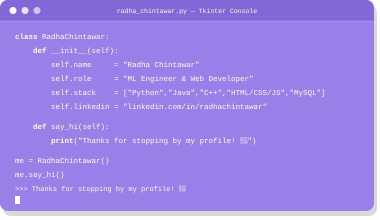

<!-- ================= HEADER ================= -->

  

  

<!-- ================= ABOUT (TKINTER TERMINAL) ================= -->
###  About Me

  

 

###  Tech Stack

  
  
  
  
  
  
  

 

###  GitHub Stats

  

 

###  Connect With Me

  
  

  

